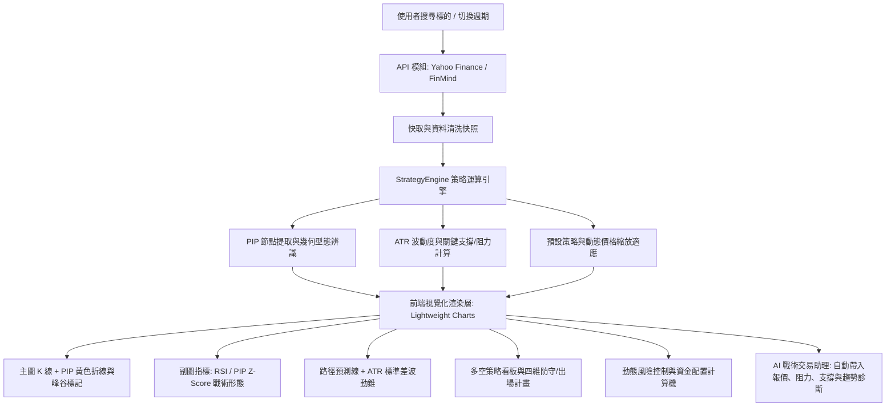

# 🧭 產品需求文件 (PRD)：AlphaLens 智能交易決策支援系統

**Status**: 🟢 Approved (RD Review Ready)  
**Author**: Alex (Senior Product Manager)  
**Last Updated**: 2026-05-23  
**Version**: 1.5  
**Stakeholders**: RD Lead, Design Lead, QA Lead, Bullet Investor (User/Champion)

---

## 1. 專案概述 (Project Overview)

### 1.1 產品定位與核心痛點
在金融交易市場中，散戶投資人常面臨資訊過載（Information Overload）以及情緒化決策（Emotional Trading）的雙重挑戰。傳統的技術分析圖表僅能呈現歷史價格與指標，無法為投資人提供「具備解釋性」的型態分析、多空路徑預測以及動態資金配置建議。

**AlphaLens** 是一款專業且兼具現代視覺質感的「智能交易決策支援系統」。本系統整合了基於 PIP (Perceptually Important Points) 演算法的幾何型態辨識引擎，並透過 LLM (Gemini API) 驅動戰術交易助理，將抽象的量價訊號轉化為高解釋性的視覺圖表與風控計劃，協助使用者進行理性、系統性的資金管理與交易決策。

### 1.2 目標對象 (Target Audience)
* **中高階獨立交易者**：有特定資金規模（如百萬台幣以上），需要精確計算每筆交易部位風險（Position Sizing）的理性交易人。
* **技術型態分析愛好者**：尋求結合自動型態辨識（如 W底、M頭、三角形突破）與傳統指標（Volume、RSI、EMA）的圖表使用者。
* **智慧型輔助決策者**：希望在下單前透過 AI 對話助手，進行交易計畫「雙重確認」與壓力測試的投資人。

---

## 2. 系統架構與業務流程 (System Architecture & Flow)

以下為 AlphaLens 核心決策與資料流的運作邏輯：

---

## 3. 核心功能規格說明 (Feature Specifications)

### Feature 1: 多螢幕適應與現代視覺系統 (Responsive UI & Dark Slate Design)
* **設計規格**：
  * **配色規範**：全面採用沉浸式暗色調設計，以深色石炭紀（Charcoal Slate-900 / 950 `#0b0f19` `#0f172a`）為基底，搭配高對比霓虹信號色（Emerald-500 `#10b981` 代表多頭/上漲，Rose-500 `#ef4444` 代表空頭/下跌，Amber-400 `#fbbf24` 代表戰術指標/警告）。
  * **毛玻璃特效 (Glassmorphism)**：核心控制面板與卡片使用 `backdrop-blur-lg` 與微幅發光邊框（`border-slate-800/80`），提升視覺的深邃感與階層感。
  * **自適應排版 (Responsive Layout)**：
    * **行動版 (Mobile < 768px)**：單欄式排版，導覽列摺疊，圖表高度智能適應（橫螢幕 240px，直螢幕 280px，防止高度塌陷）；
    * **桌機版 (Desktop >= 1024px)**：左側主工作區（2/3 寬度，承載 K 線圖、指標面板、趨勢診斷、多空策略），右側側邊欄（1/3 寬度，承載風控資金計算機、AI 戰術助理）。

---

### Feature 2: 頂級 Lightweight Charts 互動指標 K 線系統
* **設計規格**：
  * **60 根 K 棒可視範圍**：滿足業務要求，主圖預設加載顯示 60 根 K 棒，並預留右側 12 根 K 棒的時間軸偏移量（Right Offset），以便顯示未來路徑預測。
  * **成交量指標柱狀圖 (Volume Histogram Overlay)**：覆蓋於主 K 線圖下方 25% 空間。其顏色隨收盤價與開盤價強弱連動（陽線為 `rgba(16, 185, 129, 0.25)`，陰線為 `rgba(239, 68, 68, 0.25)`），既能清晰研判量價關係，又不會干擾主要 K 線的讀取。
  * **關鍵水平價位線 (Horizontal Support & Resistance Lines)**：
    * 系統自動根據歷史高峰與低谷提取關鍵價位，於主圖自動渲染 5 條水平線：**壓力二 (R2, 紅色虛線)**、**壓力一 (R1, 紅色虛線)**、**支撐一 (S1, 綠色虛線)**、**支撐二 (S2, 綠色虛線)**，以及極具信心的 **強支撐價位 (Strong Support, 綠色實線)**。
  * **互動式 OHLCV 懸浮彈窗 (Hover Tooltip)**：
    * 指標跟隨十字游標移動，即時呈現日期、開盤、收盤（隨漲跌標記綠色或紅色）、最高、最低與成交量。
    * **無干擾與衝突阻斷 (Pointer-Events Constraint)**：懸浮彈窗元件強制設定 `pointer-events: none`，防止十字游標移動至彈窗上方時產生閃爍或游標迷失 Bug。滑鼠離開圖表區域時，彈窗自動隱藏。

---

### Feature 3: PIP 幾何形態辨識引擎與副圖 Z-Score 系統
* **設計規格**：
  * **PIP 折線與標記 (Amber overlay & Peak/Trough markers)**：
    * 導入 PIP (Perceptually Important Points) 演算法，在收盤價歷史軌跡中自動提取關鍵節點（LH: 較低的高點、HL: 較高的低點等）。
    * 在主圖層啟用時，渲染一條黃色 Amber-400 的 PIP 折線連接這些節點，並在關鍵高點標示 **向下紅色箭頭 (`arrowDown` #f87171)**，在關鍵低點標示 **向上綠色箭頭 (`arrowUp` #34d399)**，實現視覺化幾何化特徵。
  * **PIP 戰術指標副圖 (Tactical Z-Score Subchart)**：
    * 支援切換「無指標」、「RSI 強弱指標 (14週期, 設有 70 超買與 30 超賣水平線)」、與「PIP 戰術形態 (Z-Score) 副圖」。
    * PIP 戰術形態副圖將 K 線收盤價轉換為 Z-Score 標準化分數，並在副圖上繪製一條黃色 PIP 波動折線。
    * 設有 **+1.5 Sigma (紅色虛線)** 與 **-1.5 Sigma (綠色虛線)** 兩道統計波動邊界，並於 PIP 節點處自動畫上亮色圓圈標示，用以提示極端超買與超賣。
  * **雙圖同步鎖定技術 (Logical Range & Crosshair Synchronization)**：
    * 主 K 線圖與副圖之間實現毫秒級雙向同步：當使用者縮放、平移主圖時，副圖時間軸完全對齊；當十字游標在主圖移動時，副圖游標同步移動，反之亦然。

---

### Feature 4: 多/空路徑預測與 ATR 波動錐形模型 (Volatility Cone)
* **設計規格**：
  * **路徑預測切換器 (Projection Switcher)**：
    * 儀表板頂部提供「路徑預測：關閉 / 多頭路徑 (黃) / 空頭路徑 (綠)」切換按鈕。
  * **多頭路徑預測 (Bullish N-Wave)**：
    * 模擬多頭突破後的「N 波上漲路徑」：分為突破（Breakout）、回測（Pullback，根據 ADX 與相對成交量動態計算回檔幅度，確保不跌破關鍵支撐）、以及末波衝刺（Final Thrust）三個階段，於未來 12 天畫出黃色虛線軌跡。
  * **空頭路徑預測 (Bearish Inverted-N)**：
    * 模擬空頭跌破後的「倒 N 波下跌路徑」：分為跌破（Breakdown）、反彈遇阻（Bounce，確保不高於空頭止損）、以及末波下跌（Final Drop）三個階段，於未來 12 天畫出綠色虛線軌跡。
  * **波動錐形軌跡圖 (Volatility Cone Overlay)**：
    * 為了防止路徑預測給出過於確定的誤導，系統基於 **ATR (Average True Range)** 與 **Rolling Standard Deviation (滾動標準差)** 進行波動度調變，在預測線的上下方，以 15% 透明度畫出 **上下標準差邊界線 (Dotted Volatility Band)**。
    * 邊界公式隨預測天數增加呈開口錐狀展開（$\pm 1.5 \times \sigma \times \sqrt{t}$），科學化呈現市場不確定性。

---

### Feature 5: 多空策略看板與「四維防守/出場計畫」(4D Exit & Defense)
* **設計規格**：
  * **對等資訊展示**：同時並列呈現「多頭策略 (BULLISH)」與「空頭策略 (BEARISH)」卡片，讓投資人不管在做多或做空時，都有預先定義的防守藍圖。
  * **動態價格縮放適應 (Scale Adaptation)**：
    * 系統內建預設的明星個股交易計畫（如家登 3680、群聯 8299）。當載入即時報價時，若最新收盤價與預設計畫的基準價格不同，系統會**自動計算價格變化比率 (Ratio)**，將計畫中的進場區間、停損價、目標價、以及文字敘述中的數值進行**動態等比縮放**，確保即時策略的可用性。
  * **四維防守/出場計畫系統 (4D Exit Plan)**：
    * 擺脫單一價格停損的盲點，提供結構化的四個出場維度：
      1. **停利出場 (Take Profit)**：明確設定 Target 1 與 Target 2 分批出場目標。
      2. **移動停利 (Trailing Stop)**：與市場波動 ATR 連動，或跌破 5MA / 10MA 軌道移動出場。
      3. **時間停損/出場 (Time Exit)**：設定特定時間長度（如 5 日或 3 日內未脫離成本區則強制減碼出場），避免資金效率低下。
      4. **形態反轉出場 (Reversal Exit)**：當出現明確的 K 線反轉特徵（如高檔爆量長上影線、低檔爆量長下影線針狀止跌）時，觸發形態出場訊號。

---

### Feature 6: 動態風險控制與資金配置計算機 (Capital Allocation Calculator)
* **設計規格**：
  * **風控輸入面板**：
    * 提供「交易帳戶總資金 (TWD, 預設 1,000,000)」與「單筆交易最大承受風險 (%, 預設 1.0%)」兩個動態調整輸入框。
  * **動態風控部位計算模型**：
    * 系統自動讀取進場區間起點（Entry Price）與停損價位（Stop Loss），精確計算每股承受風險：
      $$\text{Risk Per Share} = |\text{Entry Price} - \text{Stop Loss}|$$
    * 計算本筆交易最大允許虧損上限額度：
      $$\text{Total Risk Capital} = \text{Capital} \times \frac{\text{Risk Percent}}{100}$$
    * 動態計算出本筆策略「建議最大交易股數」：
      $$\text{Suggested Shares} = \frac{\text{Total Risk Capital}}{\text{Risk Per Share}}$$
  * **台股化中文格式轉換**：
    * 將計算出的股數自動轉換為台灣市場投資人熟悉的格式（例如：將 2550 股，自動渲染為高強度的亮黃色標記 **`2 張 550 股`**），並加註最大虧損限制金額，提供極佳的用戶體驗。
  * **預估盈虧比 (Risk-to-Reward Ratio) 警示 badge**：
    * 系統會根據 (目標一價格 - 進場價格) / (進場價格 - 停損價格) 自動算出 R:R Ratio。
    * **高對比視覺反饋**：
      * R:R Ratio $\ge$ 2.0：顯示深綠色高亮 Badge，加註「`極佳盈虧比`」，並帶有微幅脈衝呼吸燈動畫；
      * 1.5 $\le$ R:R Ratio < 2.0：顯示黃橘色 Badge；
      * R:R Ratio < 1.5：顯示灰色 Badge。

---

### Feature 7: 投資自選清單與即時大盤大數據連線 (Watchlist Hub)
* **設計規格**：
  * **跨市場與自選歸類 (ALL / US / TW)**：
    * 支援跨市場個股新增。系統透過 `isTaiwanStock` 邏輯判定，台股個股（四位數代碼如 `2330`, `3680`）自動後綴 `.TW` 或 `.TWO`，並分類到台股分頁；美股個股（字母代碼如 `AAPL`, `TSLA`）自動分類到美股分頁。
  * **即時市場焦點 (Market News)**：
    * 整合 Finnhub / RSS 新聞模組，即時拉取市場最前線焦點，呈現在右下角新聞看板，點選可直接開啟原文，兼顧量化與質化分析。
  * **台股跨週期前端聚合計算技術**：
    * 針對 FinMind API 免費版僅支援 Daily 日線的問題，系統特別設計了 **前端聚合器 (Frontend Data Aggregator)**：當切換至 Week、Month、Year 等高級週期時，前端自動將日線 OHLCV 歷史陣列以時間窗口進行聚合計算，確保台股使用者也能無縫查看跨週期技術指標。

---

### Feature 8: AI 戰術交易助理與上下文理解 (AI Decision Assistant)
* **設計規格**：
  * **上下文全感知 (Multi-context Sensing)**：
    * 當使用者與側邊欄的 AI 助理對話時，系統會**自動打包當前所有的實體數據**作為 Background Context 送給 Gemini LLM。
    * 打包數據包括：當前個股代碼與中文名稱、當前市價、S1/S2/R1/R2 關鍵點位數值、趨勢診斷結論、以及使用者自選股 Watchlist 清單。
    * **優勢**：使用者完全不需要手動輸入「家登目前價格是多少？壓力在哪？」等廢話，可以直接發問「目前形態適合切入嗎？」或「多頭突破應如何配置資金？」，助理便能給出極具深度與針對性的實戰回覆。
  * **繁體中文與富文本氣泡渲染**：
    * 系統強制指定 AI 助理輸出正體中文 (zh-TW)，格式要求多用 Markdown 列表與粗體，字句精煉實用。
    * 前端內建 Markdown-like 輕量解析器，將 `**粗體**` 自動替換為 `<strong class="font-extrabold text-white">` 標籤，並將列表 `*` 自動轉化為高對比的無序清單，氣泡樣式極具質感。

---

## 4. 非功能性需求與技術考量 (Non-functional Requirements)

### 4.1 效能與響應速度 (Performance & Smoothness)
* **輕量 Lightweight Charts 渲染**：不使用重型的 D3 或 Highcharts，確保 K 線縮放的畫格率維持在 60 FPS 以上。
* **計算快取與 Memoization**：對於 PIP 節點搜索與形態幾何計算，在 `strategyEngine.js` 內建 Memoization 機制。只要 K 線陣列長度與前後時間戳無變化，立即從 `pipCache` 與 `patternCache` 中讀取，避免重疊渲染造成的 CPU 阻塞。

### 4.2 資料一致性與Yahoo雙重驗證 (Yahoo Finance Double Validation) - [高優先級]
* **強制資料防禦機制**：
  * 為了防範 FinMind 等免費 API 可能產生的資料延遲或爬蟲遺漏 Bug，系統在產出任何戰術報告與渲染價格水平線前，**強制與 Yahoo Finance API 快照進行雙重核對 (Double Validation)**。
  * 比對系統內部最新的收盤價與 Yahoo Finance 即時 API 回傳價，若誤差在 0.5% 以內，才允許進行決策輔助與 K 線標註渲染。若不一致，需記錄警告日誌 (Log) 並重新觸發更新。

---

## 5. 驗收標準 (Acceptance Criteria)

### 5.1 繪圖與互動驗收
* [ ] **PIP 折線與標記正確性**：當偵測到 W底 (DOUBLE_BOTTOM) 時，K 線圖上必須正確連出黃色 Amber-400 的 W 型折線，且峰值與谷值上必須有對應的向下紅色與向上綠色箭頭。
* [ ] **雙圖同步性**：當使用者在主圖進行縮放 (Zoom) 或平移 (Pan) 時，下方 PIP 戰術形態副圖或 RSI 副圖必須同步縮放平移，無明顯遲滯。
* [ ] **懸浮彈窗無衝突**：十字游標移動到 Hover Tooltip 的 HTML 節點上方時，彈窗不得消失或產生高頻閃爍，鼠標移出圖表時彈窗必須完全隱藏。

### 5.2 策略與風控計算驗收
* [ ] **部位建議精確度**：輸入總資金為 `1,000,000`，單筆承受風險 `1%`（風險限額 `10,000` TWD）。若家登 (3680) 進場價為 `585`，停損價為 `527`（每股風險為 `58` 元），則計算機必須精確顯示 **`1 張 72 股`**（`172` 股，計算式：$10000 / 58 = 172.41$ 股，無條件捨去取整）。
* [ ] **R:R 警示 Badges 顏色**：若多頭策略預估盈虧比為 `2.3 : 1`，則必須顯示綠色高對比 Badge 並帶有脈衝動畫效果。

### 5.3 AI 戰術助理驗收
* [ ] **上下文感知**：在對話框中輸入「此標的的支撐位在哪裡？我該怎麼防守？」，AI 助理必須能夠在不重新詢問標的名稱的情況下，精確說出當前所選個股（如群聯 8299）的 S1、S2 價位與四維出場停損計畫。
* [ ] **格式渲染**：AI 回傳的所有 `**強調字**` 與 `* 項目` 必須正確渲染成網頁上的粗體白字與清單符號，不得直接裸露 Markdown 原始碼。
